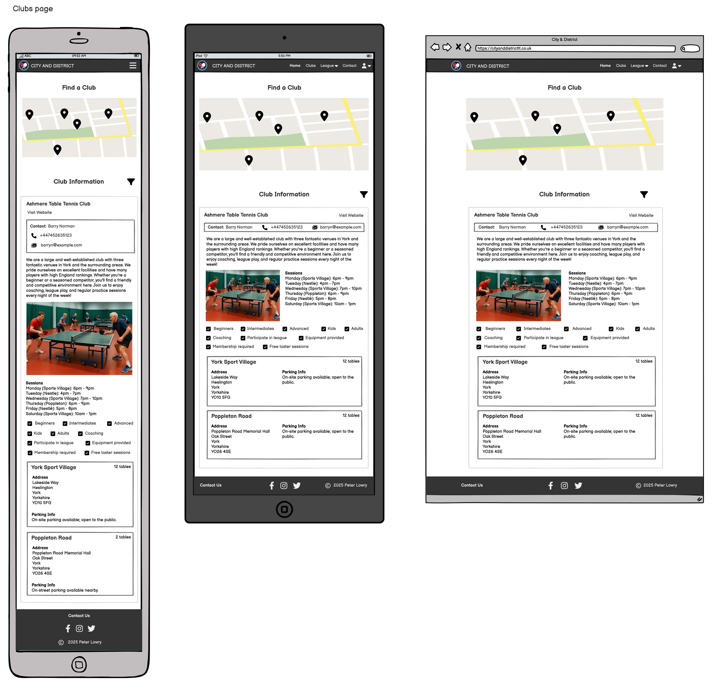
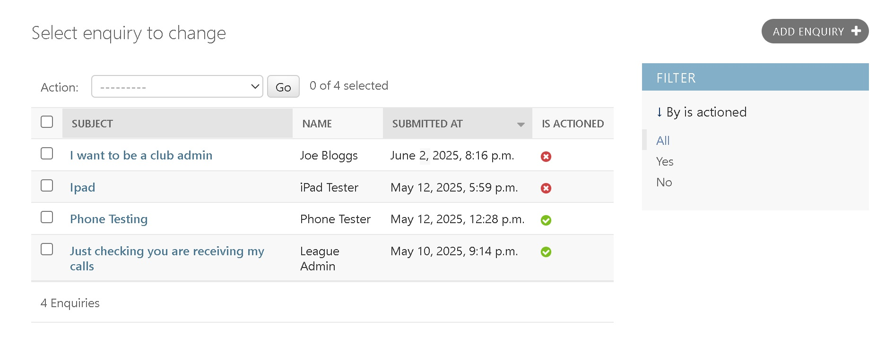
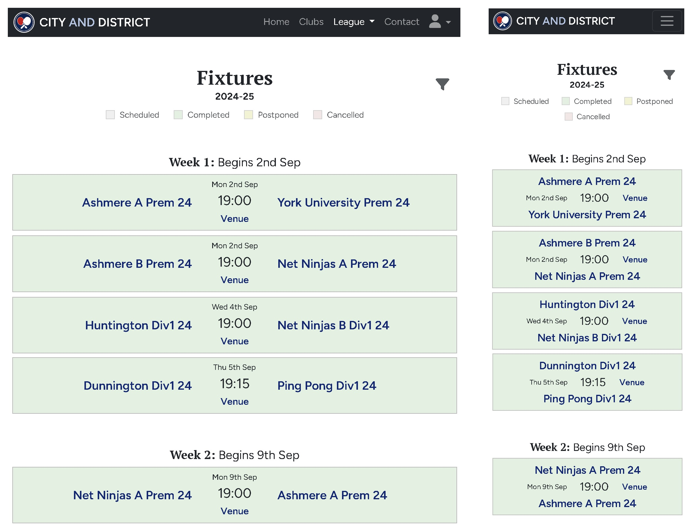
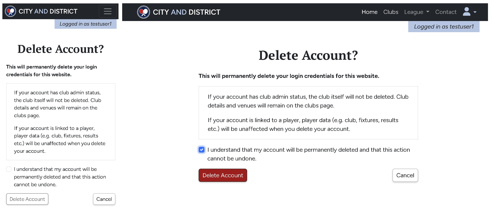
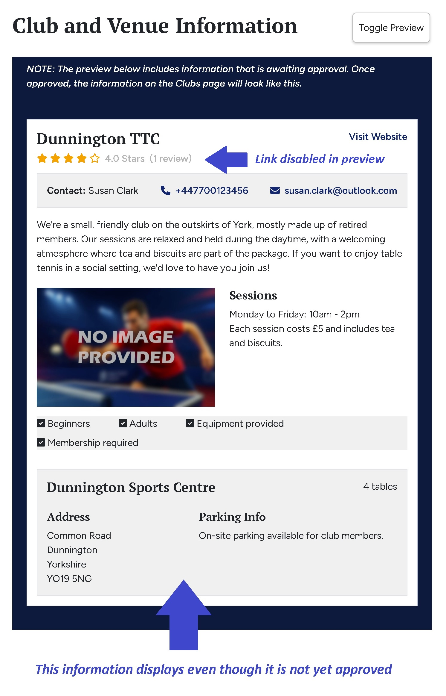

# City and District Table Tennis League

**City and District** is a fictitious table tennis league based in York and the surrounding region. This website serves as the central hub for all league-related information.

The project was built using the **Python Django** framework and deployed using **Heroku**.

You can visit the deployed website <a href="https://city-and-district-ff69b7e3e1fe.herokuapp.com/" target="_blank" rel="noopener">**here**</a>.
 


# Project Planning

The [**Project Planning**](readme-resources/planning.md) document explains my rationale and personal goals for the project. It also includes Entity Relationship Diagrams (ERDs) to show the database design.

Planning was categorised into three distinct stages of development. Each stage is outlined below, along with its rationale and completion status:

**STAGE 1: Information and Contact (COMPLETED)**
- Website displays key information about the league.
- Users can submit an enquiry to the league secretary via a contact form.
- Users can view information about table tennis clubs in the region.
- Authenticated users can be assigned club admin status to manage club information (which is approved by the league secretary).

*RATIONALE: This stage ensures that all of the key assessment criteria are met, including user authentication and CRUD functionality.*

*NOTE: In the mentor meeting that took place following the completion of stage 1, my mentor advised that more CRUD functionality should be included for regular users (not just those with Club Admin status). Therefore, the Club Review functionality was later developed to allow regular users to create, read, edit and delete club reviews.*

**STAGE 2: League Data (PARTLY COMPLETED)**
- Users can view fixtures, results, league tables, team stats and player stats.
- Authenticated users can link their account to a player to more quickly view information that relates directly to them (upcoming fixtures, recent results, etc.).

*RATIONALE: This stage provides an opportunity to plan and implement a relational database, as well as data analysis features.*

*NOTE: Pages for fixtures, results, league tables and team stats were developed. However, there was not enough time to implement the Player Stats page or the Player Dashboard where users link their account to a player.* 

**STAGE 3: League Management (PLANNED)**
- Authenticated users can be assigned permissions to submit match scores.
- Club Admins can manage club players and register teams in the league.
- League secretary can setup league seasons through the website, rather than the Django admin panel, for a more streamlined experience (e.g. generating fixtures rather than relying on manual data entry).

*RATIONALE: This stage provides an opportunity to demonstrate proficiency in problem solving and efficient design systems.*

# Agile Approach and Sprints

The planning and development of this project made use of the **GitHub Projects** tool to implement an Agile approach to development. User stories were added to a Product Backlog where they were ordered and assigned to sprints using MoSCoW prioritisation.

Each sprint (or iteration) used a Kanban Board to monitor the progress of the sprint. Any unfinished user stories were returned to the Product Backlog and optionally added to the next sprint with a new MoSCoW priority label.

You can view the project board used to manage development, including the product backlog and Kanban-style workflow, [here](https://github.com/users/lowrycode/projects/10/views/1).

The sprints were also recorded in a separate [Sprints Log](readme-resources/sprint_log.md) document. This gives a useful overview and records the MoSCoW prioritisation label given to each user story at specific moments in the development.

# Target Audience

The website aims to meet the needs of the following users:
- **Visitors** seeking to learn about what table tennis clubs and competitions are available in the area.
- **League Players** who want to view information about fixtures, results, tables, stats and possibly submit match results.
- **Club Admins** who want to manage club information, players and teams.
- **League Admin** who is the overall website administrator and wants to assign fixtures, approve results, approve club information and manage user permissions

# User Experience Design

The following features contribute to a good User Experience (UX):

## 1. Simple Structure and Intuitive Navigation

The website categorises information into the following pages:
- **Homepage** - *Includes key information about the league. Accessible from Navbar.*
- **Clubs Page** - *Displays key information about clubs in the region, including contact details for the club administrators. Accessible from Navbar.*
- **League Pages** - *Display league data, including fixture information, match results, league tables and team stats. Accessible from Navbar or links within these pages.*
- **Contact Page** - *Displays contact details for the league administrator and a contact form for submitting an enquiry. Accessible from Navbar and Footer.*
- **User Account Pages** - *Pages relating to user authentication (Login, Logout, Signup, Change Password, Account Settings, etc.). Accessible under User Profile dropdown in Navbar.*
- **Club Admin Dashboard** - *For managing club related information. Accessible under User Profile dropdown in Navbar but only accessible if user is granted "Club Admin Status".*

The *top navigation bar* and *footer* are both consistently shown on every page of the website. Since the main Call To Action (CTA) is contacting the league administrator, a link to the contact page is included in both of these sections.

Links to related pages are commonly included (e.g. the Login page links to the Signup page).

## 2. Information Architecture

In addition to categorising information on different pages, the information is also prioritised with the most important information appearing first.

For example:
- The ordering of items within the *top navigation bar* reflects the order in which users are likely to be looking for information
- The ordering of sections within the Homepage (see the [Homepage](#homepage) section for more details)

## 3. Interaction Design (IXD)

The website follows standard conventions to make it predictable and easy for users to interact with.

For example:
- The *navigation bar* is positioned at the *top* of the screen on *every page* of the website and is *consistently presented* on all pages
- The hamburger icon is used for revealing and collapsing navigation items on smaller devices
- A link to the contact page is found at the *bottom* of *every page* in the footer and is *consistently presented* on all pages
- Links to external social media platforms are found in the *footer* and are presented using the standard icons used by these platforms

The website provides users with *feedback* when they *hover over* buttons or links (with colour changes). When users submit information via a form, they are presented with a success message (or error message).

*Content hinting* is used (i.e. showing the start of the next section just above the fold) so that users know to scroll down for more content. A good example of this can be seen on the Homepage with information about the league displaying just underneath the hero image.

## 4. Accessibility

The website is made accessible for those using *screen readers* through the use of
- semantic HTML
- form labels
- alt text for images
- aria labels for icons

The *responsive design* makes the website accessible on different screen sizes and the use of *relative units* (rem) for font sizes (rather than fixed units like px) ensures that the fonts scale well with different zoom settings.

There is *good colour contrast* between text and background colours and a *sans-serif font* was chosen for body text to ensure that the text is easily readable for users.

## 5. Responsive Design

Wireframes were produced using <a href="https://balsamiq.com/" target="_blank" rel="noopener">**Balsamiq**</a> at the earliest stages of planning to ensure that the website had a good layout on different devices.

*NOTE: During development, the navbar expand breakpoint was changed from `sm` to `md` due to overflow issues when the league dropdown was added to the navbar. The wireframes below show the original designs and therefore do not reflect this change.*

*NOTE: The wireframe for the Account Settings page includes a section for Linked Players. This feature has not yet been implemented but the wireframe shows the original design.*

<details>
<summary>Main Public Pages</summary>





</details>

<details>
<summary>Authentication Pages</summary>


</details>

<details>
<summary>Pages for Managing Account Settings</summary>


</details>

<details>
<summary>Club Admin Pages</summary>


</details>

<details>
<summary>League Pages</summary>


</details>


## 6. Visual Design

### Images
Since the website was primarily seeking to serve table tennis enthusiasts, the *hero image* shows an action shot of a table tennis player and captures something of the speed and excitement of the sport.

The league logo features table tennis bats to visually reinforce its connection to the sport and enhance recognisability.

### Colour Palette
Colours were carefully chosen to *complement the hero image and league logo* and for *good visual contrast*.


The red colours were reserved for 'serious' action buttons due to its association with danger and warnings.

### Typography

Fonts were chosen which gave a professional, modern and friendly impression of the league whilst being easy to read.

For the body text, **Figtree** (with a fallback to sans-serif) was used due to its modern look and high legibility (including with numbers).

For headings, **PT Serif** (with a fallback to serif) was chosen due to its clean, professional and relaxed feel.

The combination of a serif heading font and a sans-serif body font creates a balance between traditional and contemporary styles.

## 7. Performance

### Media

To ensure that the pages load quickly, all images used on the deployed website were converted to *webp* format (with *jpg* fallback) other than those requiring transparency (such as the league logo and hero overlay) which were scaled to appropriately sized *png* files.

A suitable compromise was reached between image resolution and file size to optimise performance.

### Database Queries

Many pages rely on data from multiple database tables. To reduce the number of queries and improve page load times, data is pre-fetched using `select_related` and `prefetch_related`. View functions then manipulate this data as needed before rendering the page.

# Features Overview

## Common Features

The following features are found on all pages of the website.

### Top Navigation Bar

On tablet and larger screen sizes, the full navigation menu is shown. On mobile devices, the navigation menu is hidden and a hamburger icon is shown instead. The menu can be expanded and collapsed by touching the hamburger icon.


The items are listed in the order of priority that the users are likely to want to visit them. Clicking on the league logo provides an alternative method for navigating to the Homepage - this may be preferred by mobile users who would otherwise have to expand the navigation menu.

The default behaviour of the *Bootstrap Navbar* is retained (i.e. the hover effects and the lighter font showing the active page).

*NOTE: The items in the user dropdown menu change depending on whether the user is logged in or not. This is discussed in more detail in the [User Authentication Pages](#user-authentication-pages) section.*

### Footer

Clicking on "Contact Us" links to the Contact page. Clicking on a social media icon navigates to the relevant social media page. Clicking on the copyright information links to the GitHub repository.


All links have hover effects (brighter white), a title (which is displayed on hover) and an aria-label (to assist screen readers).

Links to external pages open in a new tab (to avoid taking users away from the main site) and use the rel="noopener noreferrer" attribute (for increased security).

### Containers

To prevent content from stretching too wide on large screens, custom container classes are implemented which complement the Bootstrap framework but add more customisation. A variety of different widths are used across the site depending on the context.

For example:
- `.container-max-8`: Limits the width to 800px - used on Homepage and Contact page
- `.container-max-6`: Limits the width to 600px - used on Accounts Settings page and various form pages used for updating club and venue information
- `.container-max-4`: Limits the width to 400px - used on narrow pages which often relate to user authentication or custom error pages (404 etc.)

## Homepage

### Hero Section

The Homepage opens with a hero image showing an action shot of a table tennis player. This is designed to immediately engage visitors and convey the energy of the sport.


The *hero overlay* includes the league logo and is positioned at the bottom of the image on smaller screen sizes but moved to the top on larger screen sizes to make better use of the available spacing without masking the image of the player.


### About Section

The next section provides a friendly welcome to the website and background information about the league. It was placed just above the fold (to prompt users to scroll down) and immediately after the *Hero* section (to inform new users as to the websites content).


### News Section

This section displays active league news items in a rotating carousel. Users can cycle through them using navigation buttons, which are hidden when only one news item is available. When no active news items are available, a placeholder message is shown instead.


The league administrator can manage news items via the Django Admin Panel, including setting publish and expiry dates for scheduled visibility.

### Useful Links Section

This section provides an alternative pathway to the Clubs, League Tables, Fixtures and Results pages which some users may prefer over using the top navigation bar. It signals to new users that these are the most significant pages of the website.


Each card includes a key word and related image to grab the attention of the user. On hovering over the card, it expands slightly with a shadow effect to indicate to the user that it is clickable.

### FAQs Section

This section answers the commonly asked questions about the league and is aimed especially at players who are interested in joining the league in the future.


All answers are hidden by default which allows users to easily skip over this section if they wish. Answers are easily revealed by clicking on either the caret symbol (down arrow) or question text. 

When a different accordion item is opened, any previously opened items will close. This keeps the section tidy and uncluttered.

By restricting the width of the container on larger screen sizes, the caret symbol remains close to the question text and is more aesthetically pleasing.


### Sponsors Section

This section displays the logos for the league sponsors.


Title and aria labels are included for each link. Clicking on a logo opens the sponsors website in another tab. The rel="noopener noreferrer" attribute is used for increased security when navigating to these sites.


## Clubs Page

Users arrive at this page by clicking the Clubs item in the navigation bar. The page allows users to find out more information about the clubs in the region. 

It includes:
- A Google Map showing the positions of the club venues.
- Information about each club listed in alphabetical order (by club name) and a filter based on checklist criteria.

All of the information on this page is dynamically populated from data in the database. The data itself is submitted by authenticated website users through restricted pages that are only accessible to users who have **Club Admin Status** on their account. All user submitted information must be approved by the league administrator before it appears on the clubs page. This approach ensures that the information is accurate and contains no offensive content.

*NOTE: More details about the Club Admin Dashboard can be found [here](#club-admin-dashboard).*

### Find-A-Club Section

This section makes use of the Google Maps JavaScript API to automatically generate markers for each (approved) venue.


The map automatically adjusts its centre and zoom settings to show all the locations. Clicking on a map marker opens an information window which includes the name of the club, a shortened address and a list of clubs that use the venue. Clicking on a club navigates to the club information on the page to improve navigation efficiency.

If there are no locations to display, a placeholder shows instead.

### Club Information Section

This section shows key information for each club.


If the club does not yet have any approved club information it will not display on the list at all. If the club admin user updates the information, the old (approved) information will display until the new information is approved. If the venue information is not yet approved, a placeholder appears.

The display also varies according to whether optional data is provided. For example:
- if a website is not provided, the "Visit Website" link does not display
- if a contact phone number is not provided, the phone number placeholder does not display
- if an image of the club is not provided, a placeholder image is displayed instead
- only the check list criteria that apply to the club are displayed

Phone numbers and email addresses are interactive and launch the system's default calling or email app when clicked.

Clicking on the Club Reviews information navigates to the **Club Review** page (more details below).

If a club uses multiple venues, all associated venues are listed under that club. If a venue is shared across clubs, it appears in each relevant club entry.

### Club Filter

Users can filter clubs using tick-box criteria. Clicking the filter icon reveals a dropdown menu where specific features can be selected. Only clubs matching all selected filters will appear in the list.


The “Membership Required” filter uses a dropdown menu to let users choose between clubs that do or do not require membership as users may want to filter based on either of these criteria.

When filters are applied, the colour of the icon changes from grey to blue and the aria-label is updated from "No filters applied" to "Filters active" to assist screen readers.

On applying a filter, only the club-info section is updated via HTMX. This approach ensures that the map is not loaded again, causing another API call.

*NOTE: This means that clubs may still display in the map info windows but no longer be present on the page. Clicking on the club in the info window does not cause any errors but it will not cause any navigation if the club is no longer on the page.*

## Club Reviews page

The Club Reviews page is where the CRUD functionality happens for a regular authenticated user.

The page is accessed when a user clicks on the Club review information for a particular club on the Clubs page.


The page header shows the club name, average review score, number of reviews and a button for returning to the Clubs page.

Each of the reviews which have been approved by the league administrator are listed. If a review is waiting approval, it will not appear in the list of visible reviews.

If the user *is not* logged in, they will see a grey banner prompting them to login to write a review (as in the image above). If a user *is* logged in, they will have the option of creating a review. If they have already written a review, they will see their own review (even if not yet approved but with a message "Your review has not yet been approved") above the reviews that others have made. They will also have the option of updating or deleting their review.


The Create Club Review and Update Club Review pages both include forms with field validation. The Update page is pre-populated with the user's existing review data.

Clicking the Delete review button takes the user to a confirmation page.

Clicking on a Return to Clubs page button takes the user back to the section they were last viewing on the Clubs page (rather than the top of the page).

*NOTE: The second 'Return to Clubs page' button only shows if there is more than one review for the club as a duplicated button is not necessary in this case and may confuse users.*

## Contact Page

When users click on the **Contact Us** link in the footer or the **Contact** item in the top navigation bar they are directed to this page. Here they can view contact information for the League Administrator or make an enquiry by filling in a form. 


The form includes the following validation:
- Required fields must be filled in
- Email addresses must be a valid email address
- Phone numbers (if provided) must be a valid UK phone number

If a user is logged in, the email field auto-populates with the email address specified in the Account Settings page but the user can provide an alternative email address if they wish.

Upon successful submission, the user is given feedback via a confirmation message (displayed at the top of the page) and the form resets. If the phone number is invalid, a warning message is displayed and an inline field error is displayed in the form.

The League Administrator can view all submitted enquiries in the Django Admin Panel which displays the Subject, Name, Submission Date and Is Actioned status for each enquiry in a table. Enquiries can also be filtered according to the "Is Actioned" status.




## League Fixtures page

The League Fixtures page can be accessed from the League dropdown menu in the navbar. It displays all league fixtures (played and unplayed) for a given season (current season by default). The fixtures are grouped by week and sorted in chronological order.



The fixtures are colour coded according to whether they are scheduled, completed, postponed or cancelled. The colour key below the title states the colours that are used for each category.

### Filtering and Jumping to Fixtures

The user can open a filter panel by pressing the filter icon. The filter panel allows the user to filter fixtures by season, division and/or club. When filtering by club, only fixtures where either the home team or away team (or both) belong to that club are displayed.

The options in the filter dropdowns update dynamically depending on what is selected in other filters. For example, if "Premier Division" is selected then only clubs with teams in the premier league will show in the Clubs dropdown.

When filters are applied, the colour of the icon changes from grey to blue and the aria-label is updated from "No filters applied" to "Filters active" to assist screen readers.


Filters are applied dynamically using HTMX, avoiding full page reloads for a faster and smoother user experience.

If the current date is within a given season, a "Jump to Current Week" link displays at the top of the page. This also streamlines the process of finding relevant fixtures.


*NOTE: This page currently loads all fixtures for a given season. While this performs well with just 5 teams, it may lead to noticeable delays if more fixtures are added. If performance becomes an issue, I would consider loading only the current and following week's fixtures by default, with an option in the filter panel to display additional fixtures.*

### Additional Fixture Information

Each fixture displays the name of the home and away teams, the fixture date, the fixture time and a "Venue" button styled as a link. Clicking the venue button opens a modal showing the venue information.


Clicking a team name navigates to its Team Summary page, which displays player details and performance statistics.

The links are styled consistently with the rest of the site, including similar hover effects and tooltips.

### Fallbacks for No Fixtures

If there are no fixtures to display, the following fallback messages may be shown instead:
- "Season not found" - when the league administrator has not marked any season as *current*.
- "No weeks to display" - when the season does not have any weeks assigned yet.
- "No fixtures this week" - when a week has no fixtures assigned (e.g. a rest week)

## League Results page

The League Results page can be accessed from the League dropdown menu in the navbar. It displays the team scores for all matches that have been played or forfeited for a given season (current season by default). The results are grouped by week. Weeks are displayed in reverse chronological order with the most recent week first. Within each week, matches are sorted in ascending chronological order (earliest first).


### Filtering Results

The filtering functionality is similar to the Fixtures page.

### Additional Result Information

Just like on the Fixtures page, clicking on a team name redirects to the Team Summary page.

Although the date of the fixture is still displayed, the time of the fixture has been replaced by the fixture result and the Venue button has been replaced by a Scores link. Clicking the scores link navigates to the [Result Breakdown](#result-breakdown-page) page.

### Fallbacks for No Results

If there are no results to display, the following fallback messages may be shown instead:
- "Season not found" - when the league administrator has not marked any season as *current*.
- "No results to display" - when no matches have yet been played.

## Result Breakdown Page

This page displays the individual match scores for each singles and doubles match, and scores for individual games when available.


The top of the page shows details about the fixture, the overall match score and the summary of how many matches were won by each player (excluding players who didn't win any matches).

A list of scores for the singles matches is shown next, ordered alphabetically by surname (home player then away player). The number of sets/games won by each player is shown and the individual game scores are shown if available.

The scores for the doubles match are shown at the bottom of the page, followed by a button to go back to the previous page.

*NOTE: The sample data includes individual game scores for the current season only.*

The following fallback messages may be shown:
- "No scores for the singles matches have been recorded" - when no data for the singles matches exists in the database.
- "No scores for the doubles match have been recorded" - when no data for the doubles match exists in the database.
- "No game scores recorded" - when individual game scores for either singles or doubles games do not exist in the database.

## League Tables page

The League Tables page can be accessed from the League dropdown menu in the navbar. It displays the league standings for all divisions within a specified season (current season by default).


Teams are ranked by points (high to low). In the event of a tie, the following secondary criteria is progressively applied until an order is resolved:
- Number of team matches won
- Number of team sets won (individual singles and doubles matches)
- Number of individual games won (within singles and doubles matches)

The league tables for different seasons can be viewed using the filter panel.

Clicking on a team name navigates to the Team Summary page for that team.

The following fallback messages may be shown:
- "Season not found" - when the league administrator has not marked any season as *current*.
- "No tables to display" - if there are no divisions assigned to the season.
- "No table to display" under the division name - if there are no teams assigned to the division yet.

If no matches have been played yet, the table shows a table including team names with initial data as in the image below.


## Team Summary Page

The Team Summary page provides an overview of team and player performance. 


Summary details for the team are displayed at the top of the page.

The players section lists all players that are registered with the team and any players who have played matches as reserves for the team. They are listed in order of percentage wins (and then total wins if tied).

All player statistics are specific to their performance for the specified team; if a player has also played for another team, their performance for the other team is not taken into consideration.

Reserve players are indicated with the word 'RESERVE' in brackets after their name.

Team results are listed in chronological order by week. Clicking on the opponent navigates to their Team Summary page. Clicking on the venue opens a modal with venue information (as already seen on the Fixtures page). Clicking on the score navigates to the Result Breakdown page for that match.

Upcoming fixtures are listed in chronological order by date. Clicking on the opponent navigates to the Team Summary page for that team and clicking on the venue opens the modal containing venue information.

Clicking the 'Go Back' button near the top or bottom of the page takes the user back to their previous page.

If the team has no fixtures, results or players yet, the page will display as in the image below.


## Error Pages

This website implements three custom error pages for HTTP status codes 403, 404 and 500.


The pages are styled in a similar way to other pages on the website and include the navbar, footer and a link back to the Homepage. This reassures the user that they are still on the website. Two of the pages also include another link to the contact page so that users can quickly navigate to their next location without any confusion.

## User Authentication Pages

One of the key assessment criteria for the project related to user authentication. These features can be accessed via the user profile dropdown in the far right of the navigation bar. The dropdown shows different options for unauthenticated users and authenticated users.


The pages themselves have access restrictions:
- If an authenticated user tries to access the Login or Signup page, they are redirected to the Homepage.
- If an unauthenticated user tries to access the Logout page, they are redirected to the Homepage.

These pages use custom templates while leveraging the functionality of the django-allauth library, such as form validation through enforcing username uniqueness, email uniqueness and strong passwords. The signup page was customized to make the email address a required field, ensuring the League Administrator can contact users if needed.

Django messages are used to provide users with feedback following form submissions.


Once a user has logged in, they are reminded of their logged-in status immediately beneath the top navigation bar on every page of the website.


*NOTE: A user does not automatically gain club admin status when they signup for an account. This is deliberate as it allows the league administrator complete control over who can create and edit club information on the site. The expectation is that the user would signup for an account and then contact the league administrator (e.g. through the enquiry form). The league administrator would then be able to check that the request is legitimate before assigning club admin status (and, if required, create a new club in the database).*

## Account Management

Another key assessment criteria for the project relates to CRUD functionality. We have already discussed how a regular user can create, read, edit and delete a review for a club.

The Account Settings page also includes CRUD functionality. It allows users to:
- View their email address.
- Change their email address.
- Change their account password.
- Delete their account.
- Drop club admin status (if assigned to their account).


If an unauthenticated user tries to access the Account Settings page, they are redirected to the Login page. If login is successful, they are automatically redirected back to the Account Settings page. This approach ensures a streamlined and predictable experience for the user.

Whenever a user carries out a delete action that is considered "serious" (irreversible and with potentially large consequences), they are required to confirm the action by ticking a confirmation checkbox. The Delete Account Confirmation page is typical in this regard. The Delete Account button is disabled until the checkbox is ticked. Numerous pages on the website adopt this pattern to ensure a consistent user experience.



## Club Admin Dashboard

Users who have been assigned club admin status can access the Club Admin Dashboard page from the user dropdown menu. 

*NOTE: This menu item will not appear for users who have not been assigned Club Admin status by the League Administrator. Assigning a user as a club admin is easily done in the Django Admin Panel using the ***Club admin*** model within the Clubs app. Phase 3 of project includes plans to develop a League Admin dashboard restricted page on the website itself; this page would include the ability to assign users as club admins.*

The page allows a club admin to manage the club and venue information that will appear on the clubs page (after approval by the League Administrator).

The CRUD functionality on this page also implements a form of version control whereby old approved information is retained. This means that any previously approved club information will continue to display on the Clubs page whilst the new information is awaiting approval by the league administrator.


Unauthenticated users who try to access this page are redirected to the login page and returned to the page after successful login. Authenticated users who do not have club admin status are redirected to the custom 403 Forbidden page.

### Managing Clubs

Club admins can add, edit and delete club information by clicking on the relevant buttons.


The same page is used for adding new club information and updating club information but when updating information the most recent version of the club information is pre-populated in the form.

*NOTE: Since every update needs approval by the league administrator before being shown on the clubs page, updating club information actually creates a new ClubInfo record rather than updating an existing record. This approach ensures that older approved information is retained and the club remains visible on the clubs page while updates await approval. Any outdated records are also deleted every time a new ClubInfo record is created (on the front end website, not Django Admin Panel).*

When deleting club information, users can choose between deleting unapproved information only (to revert back to previously approved information) or to delete both approved and unapproved information (effectively removing all associated ClubInfo records for that club). Users have to tick a confirmation checkbox before doing the latter.

### Managing Venues

Users can create new venues, assign venues to their club, unassign venues from their club, update venue information and delete venue or related information by clicking on the relevant buttons.


All venue information needs approval by the league administrator before it appears on the Clubs page.

When a user submits new venue information, the **Google Geolocation API** is used to automatically retrieve latitude and longitude data from the postcode provided by the user. This information is then used by the **Google Map API** for showing venue locations on the Clubs page.

Since venues can be shared by multiple clubs:
- A warning is displayed when a user tries to update venue information for shared venues.
- Users are allowed to delete unapproved venue information but not to delete the venue itself if it is shared with other clubs.

If a user tries to delete a venue that is linked to a team in the league, the venue will not be deleted, the user is redirected to the Club Admin page and a warning message displays "Venue could not be deleted because it is linked to protected league data".

### Preview Club and Venue Information

By clicking on the Toggle Preview button, a club admin can see the information as it will appear on the Clubs page when all information is approved by the league administrator.



If all information is approved, it will display exactly what is currently shown on the Clubs page.

If any information is not yet approved, a message appears above the preview to clarify that this is how the information will appear on the clubs page when it has been approved.

The link to the Club Reviews page is disabled in the preview. The <a> element has been replaced with a <p> element to avoid confusing screen readers.

# Future Features

So far, stage 1 has been completed.

The features planned for stage 2 relate to displaying league data. This includes:
- Fixtures page: shows upcoming league matches
- Results pages: shows match results and drilldown results for each individual game
- League Tables page: shows league tables for each division
- Analysis pages: for showing player and team stats
- The option for a user to link to a league player for a more personalised experience on the site

The features planned for stage 3 relate to league administration. This includes:
- Submitting match scores via the website
- Registering club players and teams
- A League Administrator dashboard to manage enquiries and club information approvals 
- A Fixtures Generator to streamline the process of setting up a league season

Other useful features to be added include:
- Email verification on account signup.
- Email integration with procedures for changing passwords.

# Technologies Used

## Website Development

For the front end, the website uses **HTML**, **CSS** and **Javascript**. Additional styling and functionality is provided by the **BootStrap** framework. To update page content without full page reloads, **HTMX** is used for making AJAX requests.

The following 3rd party APIs were used:
- **Google Maps JavaScript API**: for showing venue locations on the Clubs page
- **Google Geolocation API**: for finding latitude and longitude coordinates for venue locations

In addition to the standard Django packages, the following Python packages were installed along with their dependencies:
- **cloudinary**: to integrate with Cloudinary's image storage system
- **crispy-bootstrap5**: for adding Bootstrap 5 styles to forms
- **django-allauth**: for simplifying user authentication and validation
- **django-cloudinary-storage**: for using Cloudinary as Django's media and static file backend
- **django-crispy-forms**: enables crispy form rendering with template packs like Bootstrap
- **django-filter**: for simplifying forms used for filtering querysets
- **django-localflavor**: for validating postcodes
- **django-phonenumber-field**: to provide phone number field support in Django models
- **gunicorn**: for running a WSGI-compatible web server in production on Heroku
- **phonenumberslite**: for validating and formatting phone numbers (lightweight version)
- **psycopg2**: PostgreSQL adapter for Python used by Django when using Postgres
- **requests**: for making HTTP requests to Google GeoCode API on server side
- **whitenoise**: for serving static files directly from Django in production

Most of the code was written in a local copy of **Visual Studio Code**.

**Git** was used as the version control system.

**Github** was used to host the Git repository. **Github projects** was also used for planning and monitoring the development process using an *Agile* approach.

The wireframes were created using a local copy of **Balsamiq** (which was downloaded from <a href="https://balsamiq.com/" target="_blank" rel="noopener">**here**</a>).

## Image Generation and Design

Most of the images on the website were AI generated images using:
- **Stable Diffusion** (through <a href="https://github.com/ehristoforu/DeFooocus" target="_blank" rel="noopener">**DeFooocus**</a>) - used to generate more realistic, photo-style images
- **Chat GPT** - for generating the hero image and logo (both of which were then manually edited)
- **Adobe Express** - for removing objects from images

For further editing and design work, an open source image editor called <a href="https://www.gimp.org/" target="_blank" rel="noopener">**GIMP**</a> was used.

Images were optimised for the website by converting to webp format using the <a href="https://pixelied.com/convert" target="_blank" rel="noopener">**Pixelied**</a> website. JPEG images were also compressed using the <a href="https://tinypng.com/" target="_blank" rel="noopener">**TinyPNG**</a> website. 

The favicons were produced using <a href="https://favicon.io/" target="_blank" rel="noopener">**favicon.io**</a> from a custom image.

The fonts were sourced from <a href="https://fonts.google.com/" target="_blank" rel="noopener">**Google Fonts**</a> and textual icons were provided by <a href="https://fontawesome.com/" target="_blank" rel="noopener">**Font Awesome**</a>.

## Planning and Code Review

**ChatGPT** was used to speed up the planning aspects of the project. It was used cautiously, with all information verified from additional sources. Any generated content was manually edited later to make it suitable for the exact use case.

Examples of how ChatGPT was used during planning include:
- Researching the pros and cons for different Django approaches (e.g. custom user model vs related ClubAdmin model)
- Generating initial drafts for user stories with acceptance criteria and tasks (which then underwent substantial manual editing).
- Generating initial drafts for fixture data (to populate clubs with sample information)

ChatGPT was also used to aid the code review process. Some of the suggestions were taken on board whilst others were not implemented.

 

# Testing

Most of the project was developed using a Test-Driven Development (TDD) approach, with unit tests written using Django's TestCase. As a result, much of the codebase is covered by automated tests. In some instances, such as the integration of the Google Maps API, tests were added after the functionality was implemented. 

Thorough manual testing was also conducted on the deployed site before marking a user story as *Done* in the GitHub projects board. These tests are documented [here](readme-resources/manual_testing.md).

*NOTE: The tests have been ordered by website page rather than by user story, but tests covering each user story will be found in the relevant section.*

The manual tests were repeated a number of times throughout development on various browsers and devices. Before submitting the project, each of the tests were conducted again (on the deployed site) and were conducted by myself and others.

The following browsers were used during testing:
- Google Chrome
- Microsoft Edge
- Mozilla Firefox
- Apple Safari

The following devices were used during testing:
- Laptops with different screen sizes
- Various generations of iPads (1st, 8th and 9th generations)
- Samsung Galaxy tablet
- Various Android phones
- Various iPhones (including a 1st generation iPhone 5)


# Code Validation Tests

## HTML - *PASSED*

Each of the individual HTML pages were tested using the <a href="https://validator.w3.org/" target="_blank" rel="noopener">**W3C Markup Validator**</a> with the *Validate by Direct Input* option. All of the pages passed HTML validation.


Some pages required a few amendments before passing; for example, HTMX attributes were changed from the format `hx-get` to `data-hx-get` in order to pass the validation tests.

The table below explicitly states which pages were tested.

| Status  | Test Description |
| ---     | ---              |
| ✓ | **Home Page** passed without errors or warnings |
| ✓ | **Clubs Page** passed without errors or warnings |
| ✓ | **Clubs Reviews Page** passed without errors or warnings |
| ✓ | **Create Club Review Page** passed without errors or warnings |
| ✓ | **Update Club Review Page** passed without errors or warnings |
| ✓ | **Delete Club Review Page** passed without errors or warnings |
| ✓ | **Contact Page** passed without errors or warnings |
| ✓ | **League Fixtures Page** passed without errors or warnings |
| ✓ | **League Results Page** passed without errors or warnings |
| ✓ | **League Tables Page** passed without errors or warnings |
| ✓ | **Team Summary Page** passed without errors or warnings |
| ✓ | **Result Breakdown Page** passed without errors or warnings |
| ✓ | **Signup Page** passed without errors or warnings |
| ✓ | **Login Page** passed without errors or warnings |
| ✓ | **Account Settings Page** passed without errors or warnings |
| ✓ | **Change Email Page** passed without errors or warnings |
| ✓ | **Change Password Page** passed without errors or warnings |
| ✓ | **Drop Club Admin Status Page** passed without errors or warnings |
| ✓ | **Delete Account Confirmation Page** passed without errors or warnings |
| ✓ | **Confirm Logout Page** passed without errors or warnings |
| ✓ | **Club Admin Page** passed without errors or warnings |
| ✓ | **Update Club Info Page** passed without errors or warnings |
| ✓ | **Delete Club Info Page** passed without errors or warnings (with both option buttons selected) |
| ✓ | **Update Venue Info Page** passed without errors or warnings |
| ✓ | **Delete Venue Page** passed without errors or warnings |
| ✓ | **Create Venue Page** passed without errors or warnings |
| ✓ | **Assign Venue Page** passed without errors or warnings |
| ✓ | **403 Error Page** passed without errors or warnings |
| ✓ | **404 Error Page** passed without errors or warnings |
| ✓ | **500 Error Page** passed without errors or warnings |


## CSS - *PASSED*

The custom stylesheet was tested using the <a href="https://jigsaw.w3.org/css-validator/" target="_blank" rel="noopener">**W3C CSS Jigsaw Validator**</a> and returned no errors or warnings.


## JavaScript - *PASSED*

The JavaScript code was validated using <a href="https://jshint.com/" target="_blank" rel="noopener">**JSHint**</a> and it **passed without any errors or warnings**. The validator was configured to assume **New JavaScript features (ES6)**.


The table below explictly states which files were tested.

| Status  | Test Description |
| ---     | ---              |
| ✓ | **enable_button_on_confirm** passed without errors or warnings |
| ✓ | **toggle_btn** passed without errors or warnings |
| ✓ | **delete_club_info** passed without errors or warnings |
| ✓ | **delete_venue** passed without errors or warnings |
| ✓ | **initialise_map** is called by the Google Maps API, so the google variable being undefined and the initMap function being unused were ignored (they are used later in the parent template) - no other errors or warnings were found |
| ✓ | **init_venue_modal** passed without errors or warnings |

## Testing with Chrome DevTools

**Google Chrome's DevTools** was used to:
- Verify no console errors were seen when browsing and interacting with the site.
- Inspect form data (using the *Network Tab*).
- Test performance, accessibility and SEO using the *Lighthouse tool*.

### Lighthouse Tests

The *Lighthouse tool* in **Google Chrome's DevTools** was used to analyse every page on the site for performance, accessibility, best practices and SEO. The tests were carried out on the deployed site using both mobile and desktop views.

Results obtained when analysing the **desktop view** for the most significant pages on the site are shown below.


The scores for accessibility, best practices and SEO were the same using **mobile view** but the performance results were slightly lower.

# Deployment

The project was deployed with <a href="https://www.heroku.com/" target="_blank" rel="noopener">**Heroku**</a> using the following steps:

## 1. Update Code for Deployment

*NOTE: These steps are already implemented in the code in this repository but this section is included to explain why they were made before deploying the project.*

A package called **whitenoise** is used for serving static files on Heroku. 
- It was downloaded using `pip install whitenoise` and added to the requirements.txt file using `pip freeze --local > requirements.txt`

The default Django web server is not suitable for production so gunicorn is used in production.
- It was downloaded using `pip install gunicorn` and added to the requirements.txt file using `pip freeze --local > requirements.txt`

To ensure that Heroku uses gunicorn when starting the web server, a Heroku file named Procfile (with no extension) was created at the root directory and included the following contents:
- `web: gunicorn cityanddistrict.wsgi`

In settings.py, the following changes were made to ensure that the project works when deployed with Heroku:
- Added Heroku hostname to the ALLOWED_HOSTS list
    - `ALLOWED_HOSTS = [".herokuapp.com"]`
- Added Heroku to CSRF_TRUSTED_ORIGINS to allow secure POST requests
    - `CSRF_TRUSTED_ORIGINS = ["https://*.herokuapp.com"]`

**IMPORTANT:** In settings.py, it is important that `DEBUG = False` during production. However, it is useful to have DEBUG set to True when developing in the local environment so to ensure that I never accidentally forgot to change this setting back when deploying to Heroku the DEBUG variable was set with reference to an environment variable which was only present in the development environment.
- `DEBUG = os.environ.get("DEBUG_MODE", "False") == "True"`

Before submitting the final project, the setting was changed to `DEBUG = False`.

*All of these changes must be pushed to GitHub before deploying to Heroku.*


## 2. Login to Heroku (or create an account)

If you don't already have an account then you'll need to create one. Heroku have stopped offering their free tier service so you will also be required to enter your bank details and choose a payment plan.

The website also requires 2-factor authentication (e.g. using an authenticator app on your smartphone).

## 3. Create app

On the dashboard, click **New** > **Create new app** and follow the prompts to create a new app.

<details>

<summary>Step-by-step visual instructions</summary>


</details>

## 4. Add Environment Variables

*If still on the main dashboard, click on the link for the relevant app to go to the app page.*

In the **Settings** tab, scroll down to the **Config Vars** section and add the necessary environment variables.

The following environment variable keys were used in this project:
  - DATABASE_URL: provided by PostgreSQL for linking to the database.
  - SECRET_KEY: a randomly generated string used for cryptographic signing.
  - CLOUDINARY_CLOUD_NAME: provided by Cloudinary, a platform used for storing user uploaded images.
  - CLOUDINARY_API_KEY: provided by Cloudinary, a platform used for storing user uploaded images.
  - CLOUDINARY_API_SECRET: provided by Cloudinary, a platform used for storing user uploaded images.
  - GOOGLE_GEOCODE_API_KEY: provided by Google - the Google Geocoding API retrieves latitude and longitude for venue locations.

<details>

<summary>Step-by-step visual instructions</summary>


</details>

*NOTE: More details about these environment variables is included below.*


## 5. Deploy App
Navigate to the **Deployment** tab, choose Github as deployment method, connect to the relevent repository and choose your preferred method of deployment.

***NOTE:*** *Manual deployment was chosen in my case to avoid redeployments for README updates.*

<details>

<summary>Step-by-step visual instructions</summary>

### Set deployment method and connect to GitHub


### Choose automatic or manual deployment


</details>

# Forking and Cloning

**Forking** refers to making a copy of the repository in your own Github account.

To fork this repository:
1. Log in to your Github account
2. Navigate to the repository page, click the caret (down arrow) next to the fork button and choose **Create a new fork**.


**Cloning** a repository refers to making a copy on your local machine and is typically done after forking.

To clone the repository (assuming you already have git installed on your machine):
1. Navigate to the repository page, click on the **Code** button, ensure the **HTTPS** tab is selected in the dropdown and copy the url
2. On your local machine, create the directory for the cloned repository
3. Open up a terminal window (e.g. **Git Bash** or a terminal window in VSCode) and navigate to the new directory
4. Type **git clone [url]** (replacing [url] with the url address from step 1) and press Enter


To set up the project for use on your local machine with VSCode:
1. Open VSCode and create a virtual environment
    - Open the command pallette (`CTRL + SHIFT + P` or `CMD + SHIFT + P`), type in 'Python Create Environment' and select the option that appears.
    - Choose your environment (e.g. '.venv')
    - Choose the version of Python to use
2. Ensure that the virtual environment is activated.
    - The easiest way to check this is to open any Python file and check that '.venv' is displayed in the bottom information bar (on the right hand side)
3. Install the project dependencies listed in the requirements.txt file:
    - Open a terminal window in VSCode and run the command `pip install -r requirements.txt`
4. Run database migrations:
    - In the terminal window, run the command `python manage.py migrate`
5. Setup 3rd party accounts and requirements:
- a PostgreSQL database (e.g. via an Heroku Add-on service)
- a Cloudinary account (free tier is fine)
- the Google Maps JavaScript API and Google Geocoding API (via the Google Developer Console)
6. Create a .env file in the project root directory for storing sensitive settings for these services.

``` python
import os

os.environ.setdefault("DATABASE_URL", <database_url_goes_here>)
os.environ.setdefault("SECRET_KEY", <secret_key_goes_here>)
os.environ.setdefault("CLOUDINARY_CLOUD_NAME", <cloud_name_goes_here>)
os.environ.setdefault("CLOUDINARY_API_KEY", <api_key_goes_here>)
os.environ.setdefault("CLOUDINARY_API_SECRET", <api_secret_goes_here>)
os.environ.setdefault("GOOGLE_GEOCODE_API_KEY", <api_key_goes_here>)
```
7. Run the development server from the terminal using `python manage.py runserver`


# Credits

The following resources were particularly helpful in learning about various aspects of the project:
- This <a href="https://www.youtube.com/watch?v=06AWiNvjlQU&list=PLGxFXI4dC2siB2ENZ6OhagfwSId5FcWmY" target="_blank" rel="noopener">**YouTube playlist**</a> by Benjamin Day demonstrated how to implement Scrum methodologies using GitHub projects.
- This <a href="https://stackoverflow.com/questions/3098681/is-there-a-naming-convention-for-django-apps" target="_blank" rel="noopener">**Stack Overflow article**</a> was helpful during the planning stages in clarifying conventions for Django app names.
- This <a href="https://developer.mozilla.org/en-US/docs/Learn_web_development/Extensions/Server-side/Django/Testing" target="_blank" rel="noopener">**MDN tutorial series**</a> about Django testing gave a really solid foundation for how to write unit tests and the kinds of things that should be tested.
- This <a href="https://youtube.com/playlist?list=PL4cUxeGkcC9ic9O6xDW2d1qMp3rMOb0Nu&si=cCjXnT0mO1_4xW_q" target="_blank" rel="noopener">**YouTube playlist**</a> by Net Ninja gave a really helpful introduction to Django testing and clarified how it built on the Python `unittest` framework.
- This <a href="https://www.youtube.com/watch?v=REhBTwubGzo&t=502s" target="_blank" rel="noopener">**YouTube video**</a> by Stein Helset demonstrated how to apply TDD methods in Django projects
- This <a href="https://stackoverflow.com/questions/21925671/convert-django-model-object-to-dict-with-all-of-the-fields-intact" target="_blank" rel="noopener">**Stack Overflow post**</a> gave helpful information about how to convert Django model objects to dictionaries
- This <a href="https://hakibenita.com/all-you-need-to-know-about-prefetching-in-django" target="_blank" rel="noopener">**blog post**</a> by Haki Benita helped to clarify how Prefetch can be used to speed up queries by relating it to the equivalent SQL statements.


# Acknowledgments

The website was developed as part of the **Full Stack Developer Course** at <a href="https://codeinstitute.net/" target="_blank" rel="noopener">**Code Institute**</a> and was submitted as my fourth portfolio project. I would like to thank my mentor <a href="https://www.linkedin.com/in/precious-ijege-908a00168/" target="_blank" rel="noopener">**Precious Ijege**</a> for his encouragement and advice, particularly in the planning stages of the project.